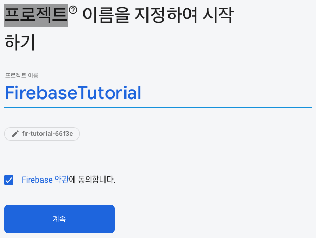
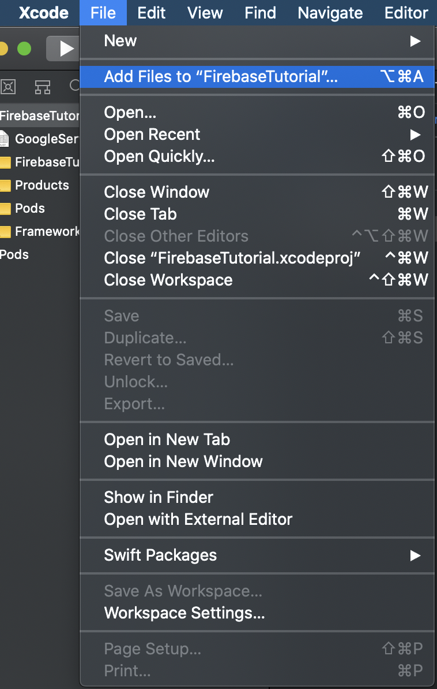
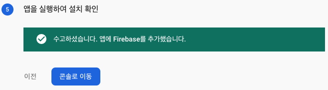
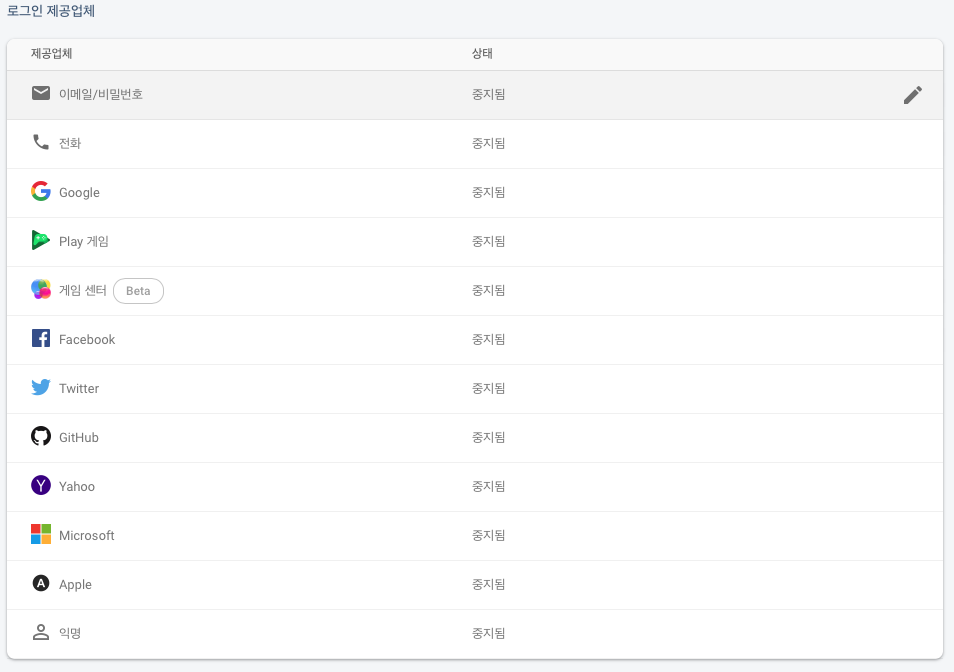
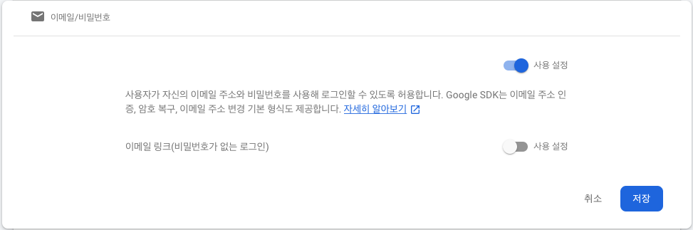
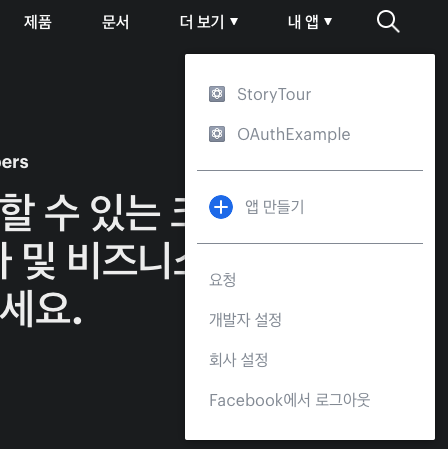
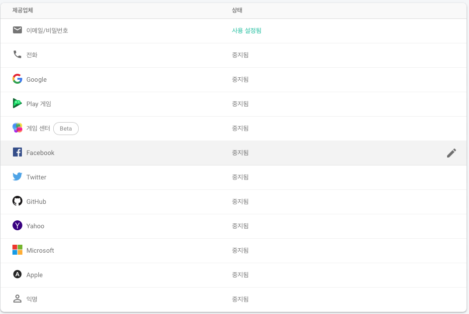
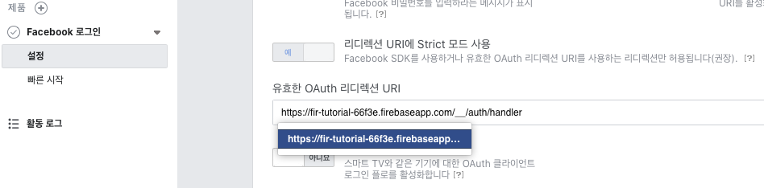
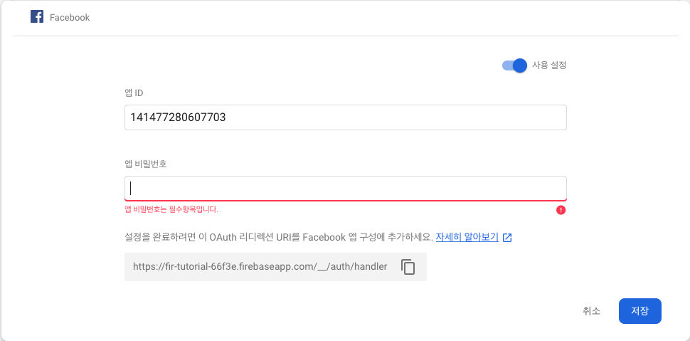

# Firebase 인증

Firebase인증의 내용은 [Document](https://firebase.google.com/docs/auth)에서 확인할 수 있습니다.

우리는 가장 많이사용하는 **FirebaseUI인증 기능**을 이용해 Firebase인증을 진행해보도록 하겠습니다.

> **FirebaseUI인증 기능**
>
> | FirebaseUI 인증        |                                                              |
> | :--------------------- | ------------------------------------------------------------ |
> | **삽입형 인증 솔루션** | 전체 로그인 시스템을 추가할 때 권장하는 방법입니다.<br /><br />FirebaseUI는 이메일 주소와 비밀번호, 전화번호는 물론 Google 로그인 및 Facebook 로그인을 비롯한 인기 ID 제공업체를 이용한 사용자 로그인의 UI 흐름을 처리하는 삽입형 인증 솔루션을 제공합니다.<br /><br />FirebaseUI 인증 구성요소는 휴대기기 및 웹사이트를 통한 인증의 모범 사례를 구현하여 앱의 로그인 및 가입 전환을 극대화합니다. <br />또한 제대로 처리하자면 오류가 발생하기 쉽고 보안에 민감한 계정 복구와 계정 연결 등의 극단적인 문제도 처리해 줍니다.<br /><br />FirebaseUI는 앱 전체의 시각적인 스타일에 어울리도록 외양을 변경하기가 쉽고 오픈 소스이므로 내가 바라는 사용자 경험을 아무런 제약 없이 구현할 수 있습니다.<br /><br />[iOS](https://firebase.google.com/docs/auth/ios/firebaseui) [Android](https://firebase.google.com/docs/auth/android/firebaseui) [웹](https://github.com/firebase/firebaseui-web) |


## E-mail

### 로그인

1. **cocoapod 추가**

   ```sh
   pod 'Firebase/Core'
   pod 'Firebase/Auth'
   ```

2. **Firebase에서 프로젝트 만들기**

   https://console.firebase.google.com/u/0/?pli=1 에서 프로젝트를 만들어줍니다.

   

   

   

3. iOS앱에 Firebase추가하기

   

   Xcode > General > Identity > Bundle Identifier 에있는 번들 ID를 넣어줍니다.
   

   

   다시 Firebase Dashboard로 돌아와서 Bundle ID를 넣어줍니다.

   

   

   

   Xcode > File > Add Files to "FirebaseTutorial" ... 를 통해 plist 파일을 추가해줍니다.

   

4. 초기화 코드 추가

   **AppDelegate.swift**

   ```swift
   import UIKit
   import Firebase // 추가
   
   @UIApplicationMain
   class AppDelegate: UIResponder, UIApplicationDelegate {
   
   
   
       func application(_ application: UIApplication, didFinishLaunchingWithOptions launchOptions: [UIApplication.LaunchOptionsKey: Any]?) -> Bool {
           // Override point for customization after application launch.
           FirebaseApp.configure() // 추가
           
           return true
       }
   // ...
   
   }
   ```

   App을 실행하여 설치를 확인합니다.

   

   

5. 이메일/비밀번호로 로그인할 수 있도록 설정

   Dashboard 가운데에 있는 Authentication 을 선택

   

   로그인 방법 설정을 정합니다. 아리의 그림에서 "이메일/비밀번호"를 선택합니다.
   

   다음과 같이 설정하고 저장합니다.

   

   

6. 코드 작성

   **ContentView.swift**

   ```swift
   import SwiftUI
   import Firebase
   import FirebaseAuth
   
   class ViewModel{
       func login() {
           
       }
   }
   
   struct ContentView: View {
       @State private var email: String = ""
       @State private var pw: String = ""
       
       var body: some View {
           VStack {
               Text("E-mail")
                   .bold()
               TextField("Enter your email", text: $email)
               
               Text("Password")
                   .bold()
               SecureField("password", text: $pw)
               
               Button(action: self.login) {
                   Text("Login")
               }
           }
       }
       
       func login(){
           Auth.auth().signIn(withEmail: self.email, password: self.pw) { (user, error) in
               if user != nil{
                   print("login success")
                   print(user)
               }else{
                   print(error)
               }
           }
           
       }
   }
   ```

### 회원가입

회원가입은 지금 까지 세팅해준 Firebase 설정을 건드릴필요는 없고 코드 몇부분을 추가해주면 됩니다.

```swift
struct ContentView: View {
    @State private var email: String = ""
    @State private var pw: String = ""
    
    var body: some View {
        VStack {
            Text("E-mail")
                .bold()
            TextField("Enter your email", text: $email)
            
            Text("Password")
                .bold()
            SecureField("password", text: $pw)
            
            Button(action: self.login) {
                Text("Login")
            }
            
            Button(action: self.signUp) {
                Text("SignUp")
            }
        }
    }
    
    func login(){
        Auth.auth().signIn(withEmail: self.email, password: self.pw) { (user, error) in
            if user != nil{
                print("login success")
                print(user)
            }else{
                print(error)
            }
        }
    }
    
    func signUp(){
        Auth.auth().createUser(withEmail: self.email, password: self.pw) { (user, error) in
            if(user != nil){
                print("register successs")
                print(user)
            }else{
                print("register failed")
            }
        }
    }
}
```


회원가입을 누르면 아래의 사진과 같이 FirebaseDash에 데이터가 들어간 것을 볼 수 있습니다.


## 페이스북 로그인 

### 페이스북 개발자 설정

> 아래의 내용은 https://developers.facebook.com/apps/141477280607703/fb-login/quickstart/?sdk=cocoapods 에서 볼 수 있습니다.

1. https://developers.facebook.com에서 내앱 > + 앱만들기를 클릭합니다.

   

   

2. 적절한 이름 선택후 ID를 만들어 줍니다.

   

3. cocoapod을 이용해 SDK를 설치해줍니다.

   ```sh
   pod 'FBSDKLoginKit'
   ```

4. 번들 ID를 넣어줍니다.

   

5. SSO는 설정해주지 않습니다.

   [SSO(Single-Sign-On)](https://www.facebook.com/help/work/932696040193798?helpref=uf_permalink)은 간단히 말해서 한번 접속하고 나면 다음에 접속할땐 아이디랑 비밀번호를 물어보지 않고 바로 접속해주는 기능입니다.

   

6. Info.plist 구성

   아래의 코드를 Info.plist를 코드로 열어서 \<dict> ... \</dict> 사이에 넣어줍니다.

   ```xml
   <!--facebook-->
       <key>CFBundleURLTypes</key> <array> <dict> <key>CFBundleURLSchemes</key> <array> <string>fb141477280607703</string> </array> </dict> </array> <key>FacebookAppID</key> <string>141477280607703</string> <key>FacebookDisplayName</key> <string>iOS_FirebaseTutorial.neowiz</string>
       <!--facebook communication box-->
       <key>LSApplicationQueriesSchemes</key> <array> <string>fbapi</string> <string>fbapi20130214</string> <string>fbapi20130410</string> <string>fbapi20130702</string> <string>fbapi20131010</string> <string>fbapi20131219</string> <string>fbapi20140410</string> <string>fbapi20140116</string> <string>fbapi20150313</string> <string>fbapi20150629</string> <string>fbapi20160328</string> <string>fbauth</string> <string>fbauth2</string> <string>fbshareextension</string> </array>
   ```

   

7. Delegate method 추가

   **AppDelegate.swift**

   ```swift
   func application(_ app: UIApplication, open url: URL, options: [UIApplication.OpenURLOptionsKey : Any] = [:]) -> Bool {
           // 'FBSDKApplicationDelegate' has been renamed to 'ApplicationDelegate'
           return ApplicationDelegate.shared.application(
               app,
               open: (url as URL?)!,
               sourceApplication: options[UIApplication.OpenURLOptionsKey.sourceApplication] as! String,
               annotation: options[UIApplication.OpenURLOptionsKey.annotation])
       }
   ```

   **SceneDelegate.swift**

   ```swift
   func scene(_ scene: UIScene, openURLContexts URLContexts: Set<UIOpenURLContext>) {
           if let openURLContenxt: UIOpenURLContext = URLContexts.first{
               ApplicationDelegate.shared.application(
                   UIApplication.shared,
                   open: openURLContenxt.url,
                   sourceApplication: openURLContenxt.options.sourceApplication,
                   annotation: openURLContenxt.options.annotation)
               
           }else{
               return
           }
           
       }
   ```

   

8. Firebase에 OAuth 리디렉션 URI 가져오기

   Facebook 로그인 > 설정 > 유효한 OAuth 리디렉션 URI 에 채워넣기 위해 Firebase에서 작업을 진행하겠습니다.

   

   

   Firebase dashboard에서 Facebook을 선택하면 

   

   

   아래와 같이 OAuth 리디렉션 URI가 있습니다.

   

   

   이를 복사해 Facebook 대시보드에 넣어줍니다.

   

   

9. firebase에 앱 ID 비밀번호 설정

   Facebook dashboard > 설정 > 기본 설정 에서 `앱 ID`와 `앱시크릿 코드`를 가져옵니다.

   

   그리고 Firebase dashboard의 facebook에 각각 채워넣어 줍니다.

   

### Firebase Auth(facebook)

1. [개발자 문서](https://developers.facebook.com/docs/facebook-login/ios)를 참고해 앱에 Facebook 인증을 통합합니다.
   SwiftUI를 사용하기에 LoginButton은 사용하기가 까다롭습니다. 우리는 Custom Button을 사용하겠습니다.

   우선 FacebookLogin 함수를 호출합니다.

   ```swift
   func fbLogin(){
           let cont = UIHostingController(rootView: self) // convert to UIController from SwiftUI
           // 'FBSDKLoginManager' has been renamed to 'LoginManager'
           let fbLoginManager: LoginManager = LoginManager()
           fbLoginManager.logIn(permissions: ["email"], from: cont) { (result, err) in
               if err != nil{
                   print("Process error")
               }else if result?.isCancelled == true{
                   print("Cancelled")
               }else{
                   print("Logged in")
                   self.getFBUserData()
               }
           }
           
       }
   ```

2. 성공적으로 Login이 되었다면 UserData를 받아옵니다.

   ```swift
   func getFBUserData(){
           if AccessToken.current != nil{
               GraphRequest(graphPath: "me", parameters: ["fieldds": "id, name, first_name, last_name, picture.type(large), email"]).start { (connection, result, err) in
                   if(err == nil){
                       print(result)
                   }else{
                       self.fbFirebaseAuth()
                   }
               }
           }
       }
   ```

3. 마지막으로 Firebase에 SignIn 리다이렉션을 보냅니다.

   ```swift
   func fbFirebaseAuth(){
           // 'FIRFacebookAuthProvider' has been renamed to 'FacebookAuthProvider'
           // 'FBSDKAccessToken' has been renamed to 'AccessToken'
           let credential = FacebookAuthProvider.credential(withAccessToken: AccessToken.current!.tokenString)
           Auth.auth().signIn(with: credential) { (user, error) in
               if(user != nil){
                   print("FB login success")
                   print(user)
               }else{
                   print("FB login failed")
                   print(error)
               }
           }
       }
   ```

   

4. 버튼을 눌러 로그인을 해봅니다.

   

   

   제대로 UserData를 받아오는 것을 볼 수 있습니다.

   

## 전체 코드

https://github.com/kiryun/iOS-FirebaseAuthTutorial/tree/5d813b1944c4eb0a974a0975ff698b9e3e063e38 에서 볼 수 있습니다.

## References

* https://sh-itstory.tistory.com/61
* https://zeddios.tistory.com/159
* https://zeddios.tistory.com/160?category=682195
* https://zeddios.tistory.com/47
* https://brunch.co.kr/@tilltue/13